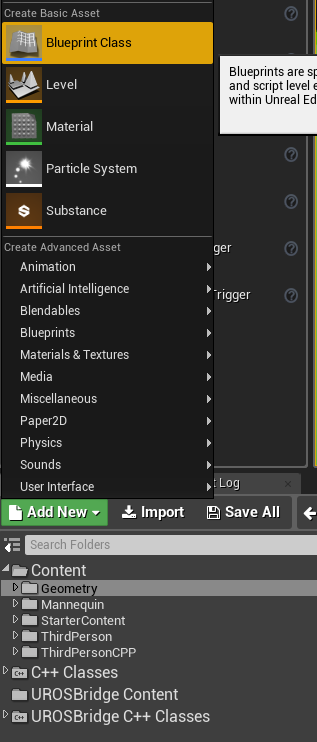
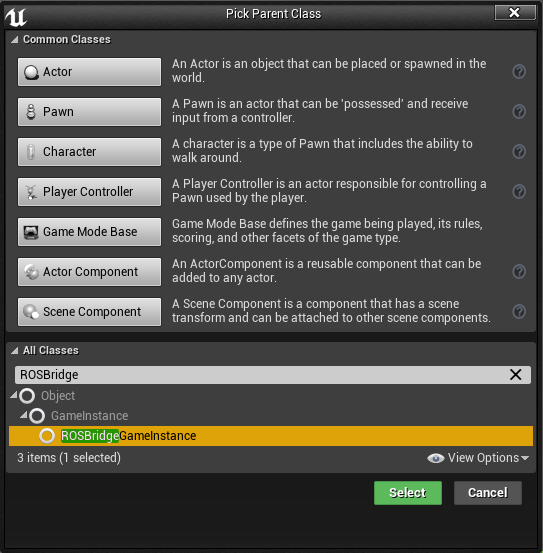
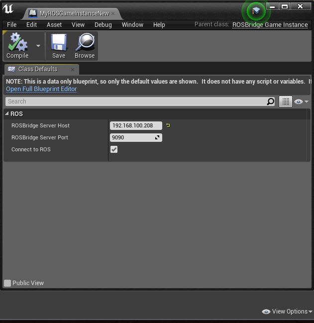

### Hold a single UROSBridge Handler in a custom Game Instance

UROSBridge needs a single instance of ROSBridgeHandler to take care of all ROS communication.
In order to keep this in a central place, it's good practice to keep this instance in a custom GameInstance class.
This acts as a Singleton and can be accessed by all Actors in your environment to interact with ROS.
A benefit of this Game Instance is also that it can be configured from within your UE4Editor,
so you don't need to put your connection parameters into your code.

#### Configuration
- Install UROSBridge as usual
- Add a new Blueprint to your Project:


- Let it derive from ROSBridgeGameInstance to get the basic handler logic and parameter handling:

- Open your newly created Blueprint and set the connection parameters for UROSBridge:

- **Set your new game instance in your project settings: Edit -> Project Settings -> Maps & Modes -> Game Instance Class**

#### Usage
As an example, we'll set up the game instance and create an Actor that publishes something on /talker on every Tick():

- Create an AActor in your Project
- Add a Publisher and the corresponding to the Header File of your AActor:
```cpp
#include "ROSBridgePublisher.h"

.....
protected:
  TSharedPtr<FROSBridgePublisher> Publisher;
```
- Add the Header file of the ROSBridgeGameInstance class and declare a publisher:

```cpp
#include "ROSBridgeGameInstance.h"

....

void AExampleActor::BeginPlay() {
	Super::BeginPlay();

	// Accessing the Game Instance and checking for nullptr
	check(GetGameInstance());

	// Getting the actual UROSBridgeGameInstance 
	UROSBridgeGameInstance* ActiveGameInstance = Cast<UROSBridgeGameInstance>(GetGameInstance());
	check(ActiveGameInstance);

	check(ActiveGameInstance->ROSHandler.IsValid());

	Publisher = MakeShareable<FROSBridgePublisher>(new FROSBridgePublisher(TEXT("/talker"), TEXT("std_msgs/String")));
	ActiveGameInstance->ROSHandler->AddPublisher(Publisher);

	ActiveGameInstance->ROSHandler->Process();
}

void AExampleActor::Tick(float DeltaTime) {
	Super::Tick(DeltaTime);

	TSharedPtr<std_msgs::String> StringMsgPtr(new std_msgs::String(TEXT("Test String")));

	UROSBridgeGameInstance* ActiveGameInstance = Cast<UROSBridgeGameInstance>(GetGameInstance());
	check(ActiveGameInstance);
	ActiveGameInstance->ROSHandler->PublishMsg("/talker", StringMsgPtr);
}
```
